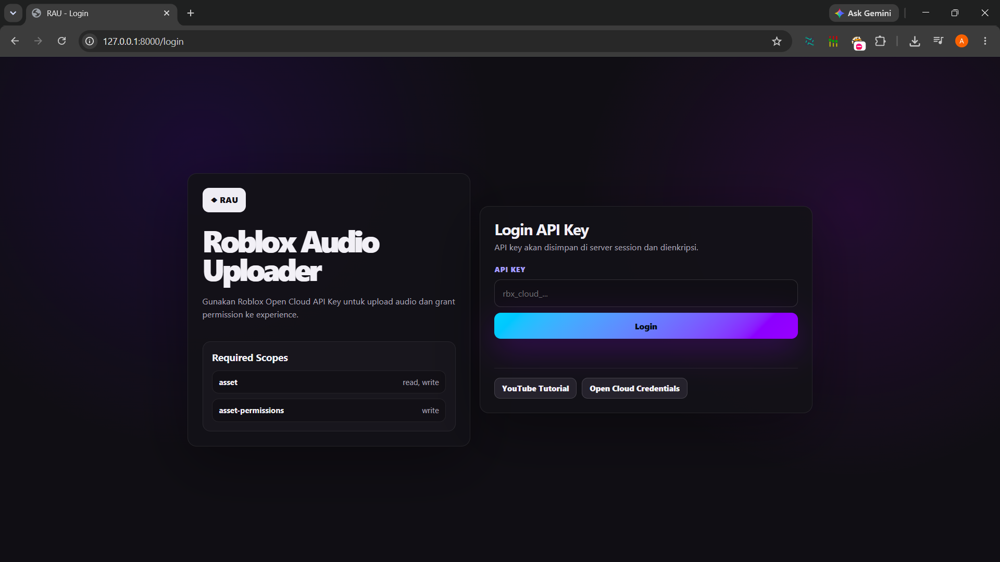
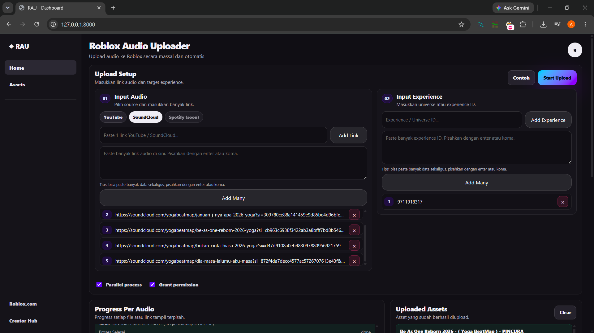
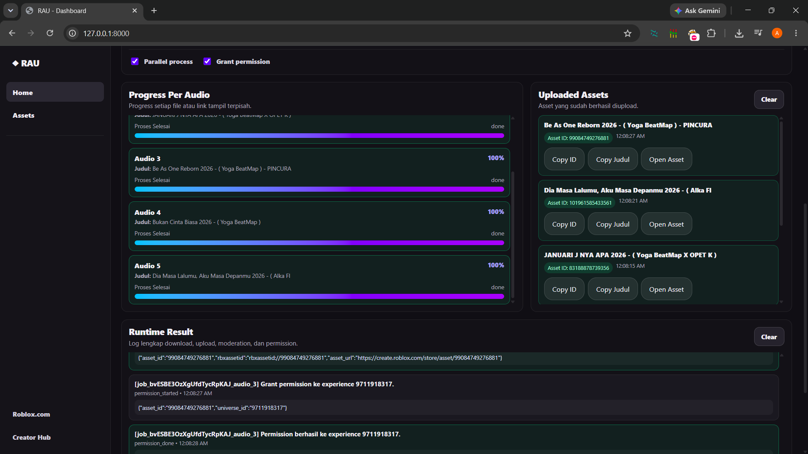
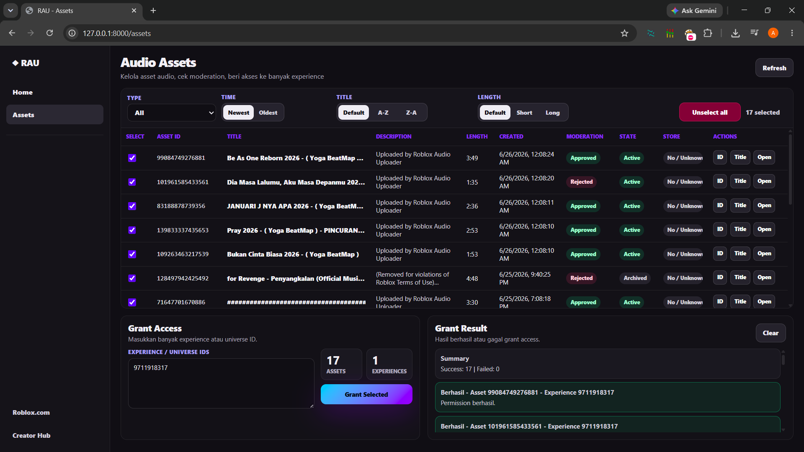

<h1 align="center">RAU - Roblox Audio Uploader</h1>

<p align="center">
  Web app untuk upload audio Roblox secara massal, grant permission ke banyak experience, dan pantau proses secara real-time.
</p>

<p align="center">
  
  
  
  
  
</p>

---

<!-- ## Deskripsi -->

**RAU** adalah aplikasi web sederhana untuk mengambil audio dari YouTube atau SoundCloud, mengupload audio ke Roblox, lalu memberikan akses asset ke satu atau banyak experience menggunakan **Roblox Open Cloud API Key**.

---

## Preview

<table>
  <!-- <thead>
    <tr>
      <th width="45%">Screenshot</th>
      <th>Penjelasan</th>
    </tr>
  </thead> -->
  <tbody>
    <tr>
      <td>
        
        <br>
        <!-- <code>~/screenshot/login_page.png</code> -->
      </td>
      <td>
        <h3>Login Page</h3>
        <p>
          Halaman login untuk memasukkan <b>Roblox Open Cloud API Key</b>. API key dipakai untuk validasi akun Roblox dan mengakses fitur upload asset.
        </p>
      </td>
    </tr>
    <tr>
      <td>
        
        <br>
        <!-- <code>~/screenshot/home_page_form.png</code> -->
      </td>
      <td>
        <h3>Home Page - Form Upload</h3>
        <p>
          Halaman utama untuk memilih source audio, memasukkan banyak link YouTube atau SoundCloud, dan memasukkan target experience / universe ID.
        </p>
      </td>
    </tr>
    <tr>
      <td>
        
        <br>
        <!-- <code>~/screenshot/home_page_process.png</code> -->
      </td>
      <td>
        <h3>Home Page - Proses Upload</h3>
        <p>
          Menampilkan progress setiap audio, asset yang berhasil diupload, serta log runtime untuk download, upload, moderation, dan permission.
        </p>
      </td>
    </tr>
    <tr>
      <td>
        
        <br>
        <!-- <code>~/screenshot/assets_page.png</code> -->
      </td>
      <td>
        <h3>Assets Page</h3>
        <p>
          Halaman untuk melihat asset audio yang pernah diupload, mengecek moderation state, memilih banyak asset, dan grant access ke banyak experience.
        </p>
      </td>
    </tr>
  </tbody>
</table>

---

## Cara Install

<div>
  <h3>Warning</h3>
  <p>
    Pastikan <b>Python 3.10+</b> dan <b>Git</b> sudah terinstall sebelum menjalankan project ini.
  </p>
</div>

### 1. Clone Repository

```bash
git clone https://github.com/DapuntaRatya/RobloxAudioUploader
cd RobloxAudioUploader
```

### 2. Install Requirements

Project ini bisa dijalankan langsung tanpa venv.

```bash
python -m pip install -r requirements.txt
```

Jika terjadi masalah permission, gunakan:

```bash
python -m pip install --user -r requirements.txt
```

Jika perintah `python` tidak terbaca, coba gunakan:

```bash
py -3.10 -m pip install -r requirements.txt
```

### 3. Generate Kunci Enkripsi Aplikasi

Project ini membutuhkan `FERNET_KEY` untuk mengenkripsi Roblox API Key yang dimasukkan lewat halaman login.

Jalankan perintah berikut:

```bash
python -c "from cryptography.fernet import Fernet; print(Fernet.generate_key().decode())"
```

Jika perintah `python` tidak terbaca, gunakan:

```bash
py -3.10 -c "from cryptography.fernet import Fernet; print(Fernet.generate_key().decode())"
```

Copy hasil output dari command tersebut. Contohnya akan terlihat seperti ini:

```txt
3G4W9oOZQ8pW9f3qC0IuQ5wQK5W3U7dKQ8zS2Yp7nH0=
```

### 4. Siapkan File Environment

Buat file `.env` di root project.

Isi file `.env` seperti berikut:

```env
APP_NAME=RobloxAudioUploader
APP_ENV=local
APP_DEBUG=true
APP_HOST=127.0.0.1
APP_PORT=8000

SESSION_COOKIE_NAME=rau_session
FERNET_KEY=paste_hasil_generate_di_sini

DATA_DIR=app/data
TEMP_DIR=app/temp
FFMPEG_LOCATION=
```

Ganti bagian ini:

```env
FERNET_KEY=paste_hasil_generate_di_sini
```

dengan hasil generate dari langkah sebelumnya.

Contoh:

```env
FERNET_KEY=3G4W9oOZQ8pW9f3qC0IuQ5wQK5W3U7dKQ8zS2Yp7nH0=
```

### 5. Inisialisasi Database

```bash
python -m scripts.init_db
```

Jika perintah `python` tidak terbaca, gunakan:

```bash
py -3.10 -m scripts.init_db
```

### 6. Jalankan Server

```bash
python -m uvicorn app.main:app --reload
```

Jika perintah `python` tidak terbaca, gunakan:

```bash
py -3.10 -m uvicorn app.main:app --reload
```

### 7. Buka di Browser

```txt
http://127.0.0.1:8000
```

---

## Alur Penggunaan

<ol>
  <li>Buka <code>http://127.0.0.1:8000/login</code>.</li>
  <li>Masukkan Roblox Open Cloud API Key.</li>
  <li>Masuk ke dashboard <code>/</code>.</li>
  <li>Pilih source audio: YouTube atau SoundCloud.</li>
  <li>Masukkan satu atau banyak link audio.</li>
  <li>Masukkan satu atau banyak experience / universe ID.</li>
  <li>Klik <b>Start Upload</b>.</li>
  <li>Pantau progress dan runtime result.</li>
  <li>Buka <code>/assets</code> untuk melihat asset dan grant access massal.</li>
</ol>

---